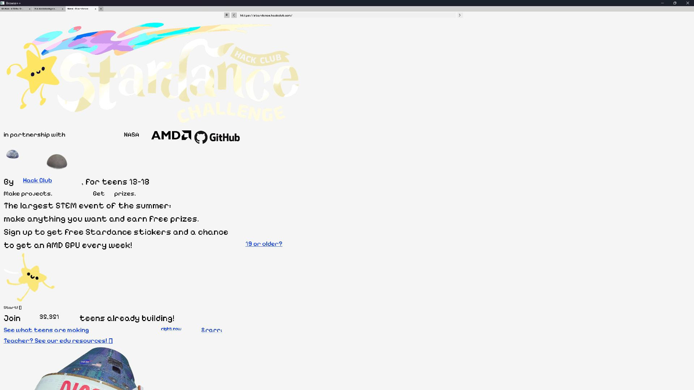

<h2 align="center">Screenshots</h2>

  
  

  

# Browse++ A C++ Browser Engine from Scratch.

A custom-built C++ web browser engine written from scratch to support HTTP and HTTPS, with a web and desktop version.

## Features

- HTTP & HTTPS networking

- Parsing and DOM generation

- Terminal UI (for now)

## Demo

Try out a web version of it!

https://k754a.hackclub.app/

## Roadmap

- Add a DOM tree 🗸

- Add a layout tree 🗸

- Render to a screen 🗸

- Tab management 🗸

- CSS parser 🗸

- Add a CSS DOM tree 🗸

## AI notice

AI has been used in some aspects of this project.

- As a learning tool, an example of which is to generate general examples or to help explain how aspects like trees work in C++, not rewrite, fix, or debug any of my code whatsoever.

- The native Windows code to Linux for the server. Any code changes are clearly marked with (`// CHANGED WITH AI: ...`) if they have been changed with AI.

- The main windows project has NOT been coded with AI whatsoever.

# Contributing

Feel free to make your own forks of this project, add things, and find issues!

---

# ⭐ Support the Project

If you find Browse++ interesting, please consider giving it a ⭐!

It helps more people discover the project!

---

