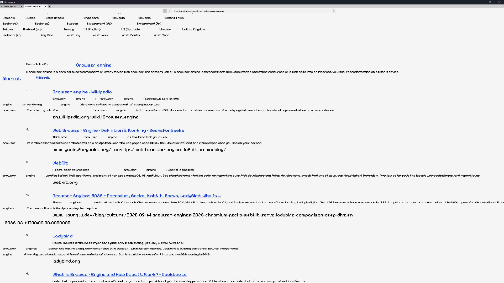

  
  

  

  <h1>Browse++: A C++ Browser Engine from Scratch.</h1>

  
  
  
  

A custom-built C++ web browser engine written from scratch to support HTTP and HTTPS, with a web and desktop version.

# About

Browse++ is an experimental browser engine written entirely in C++. Instead of using something like Chromium, my engine has its own networking, parsing, DOM handling, layout engine, and rendering pipeline.

The goal of this project is to better understand how modern browsers work!

---

## Features

- HTTP & HTTPS support

- Parsing and DOM generation

- CSS parser

- Layout tree

- Rendering engine (using SDL3!)

- Tabs support

- Web version (far behind tho)

## Demo

Try out a web version of it!

https://k754a.hackclub.app/

# Project Goals

- Build a browser engine while using as few external libraries as possible

- Learn how browsers actually work

- Build an awesome project for my resume!

## Roadmap

- Add a DOM tree 🗸

- Add a layout tree 🗸

- Render to a screen 🗸

- Tab management 🗸

- CSS parser 🗸

- Add a CSS DOM tree 🗸

### Next

- FlexBoxes

- Settings

- Be faster

- better formatting

- Maybe JavaScript (if I get to it)

## AI notice

AI has been used in some aspects of this project.

- As a learning tool, an example of which is to generate general examples or to help explain how aspects like trees work in C++, not rewrite, fix, or debug any of my code whatsoever.

- The native Windows code to Linux for the server. Any code changes are clearly marked with (`// CHANGED WITH AI: ...`) if they have been changed with AI.

- The main windows project has NOT been coded with AI whatsoever.

# Contributing

Feel free to make your own forks of this project, add things, and find issues!

---

# ⭐ Support the Project

If you find Browse++ interesting, please consider giving it a ⭐!

It helps more people discover the project!

---

