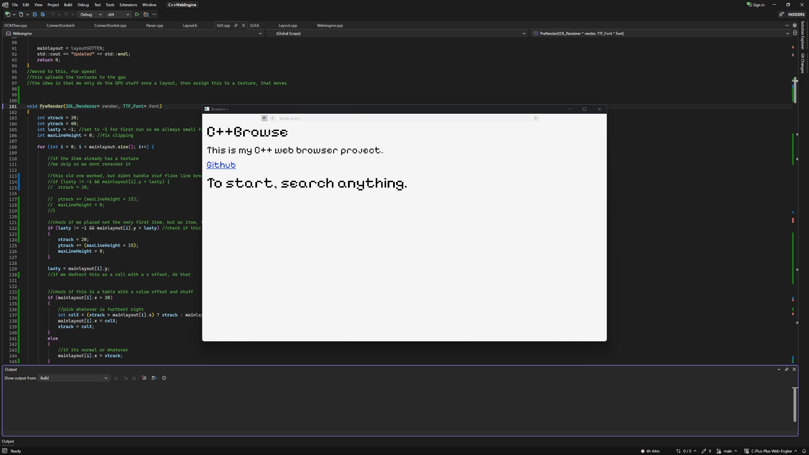
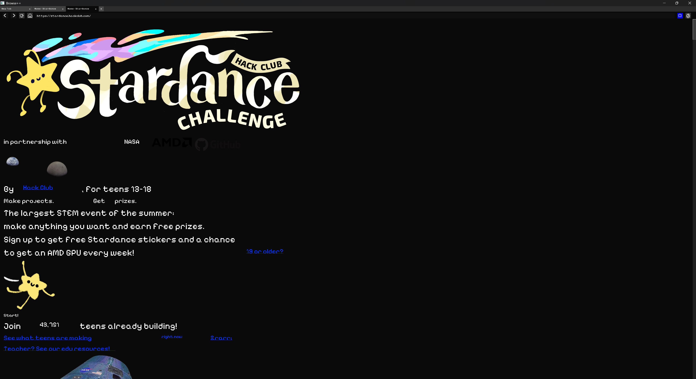
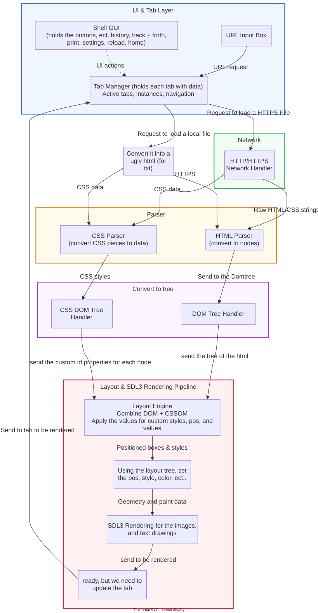

<p align="center">
  
  
</p>
<p align="center">
  
</p>

<div align="center">
  <h1>Browse++: A C++ Browser Engine from Scratch.</h1>
</div>

<p align="center">
  
  
  
  
  
</p>

<h3 align="center"> A custom C++ web browser engine written from scratch, with a web and desktop version. </h3>

---


## Table of Contents
- [What is Browse++?](#About)
- [How to use?](#how-to-usedemo)
- [Features](#Features)
- [Project Goals](#project-goals)
- [How does it work?](#how-does-it-work)
- [Cool things in the project](#cool-ideas-i-put-into-the-project)
- [AI Notice](#ai-notice)

# About:

**Browse++** is an experimental browser engine written entirely in C++ from almost scratch.

A basic definition of a browser engine is a program that pulls content from a website, then takes that content, gives the elements the properties assigned in the CSS, and then renders the content on the screen. They are super difficult to build, as they need to handle hundreds of different properties, as well as broken HTML and CSS (as they are not a language with a syntax). This project I built, with only one extra package for rendering, but the networking, parsing, DOM tree, layout, and GUI are programmed from scratch.

This browser supports Windows and Linux and has a web version if you don't want to download anything.

This project was created to help me learn C++ as well as understand and appreciate how modern browsers operate and work under the hood. 

# How to Use/Demo

There are quite a few ways to use the engine, if you would not like to download something, you can use the web demo (or [watch the video](https://www.youtube.com/watch?v=I-mCh9xSYeg&t=8s)). But if you want to run it on your own hardware, you can go to the [releases page](https://github.com/k754a/releases).

### No download way:

&emsp;If you would like to try the demo without needing anything downloaded, you can try it here: [k754a.hackclub.app](https://k754a.hackclub.app/)

### Download precompiled:

>[!WARNING]
> Linux does not currently have a network part, so unfortunetly it can't load websites. Currently the only way to run it is building it directly, but hopefuly once I get a framework, ill make sure it works.

&emsp;If you would like to run the program locally, you can do such with the release build [here](https://github.com/k754a/C-Plus-Plus-Web-Engine/releases). Download the file for your OS (Windows or Linux)

### Build from source:
&emsp;If you would like to build from source, you can read the guides for [Windows](#build-for-windows) or [Linux](#build-for-linux).


## Features

- HTTP & HTTPS support

- Parsing and DOM generation

- CSS parser

- Layout tree

- Rendering engine (using SDL3!)

- Tabs support

- Web version (Missing some of the features...)

- Dark + light Mode

- Right click custom menu

- History Tab

- File loading

- HTML style handling properties (ex. ```<h1 style="text-align:center; vertical-align:top; color:#000000; font-weight:900;"> Example </h1>``` )

- Bookmark system

- Page Printing

- Opening tabs in new instances

- Custom Text positioning/properties.

# Project Goals

- Build a browser engine while using as few external libraries as possible.

- Learn how browsers actually work.

- Build an awesome project for my resume!

- Attempt to add as many features as I can!


# How does it work?

### This diagram shows very well, how the engine works.


This is more of a guide of what each part is. First, the browser engine gets a request, be that for a local or a URL, then the URL is parsed, and using the network, all the HTML is pulled and sent to the parser. The local file is slightly changed to work for HTML, then is sent to the parser as well.

The parser turns the random style and HTML tags and splits them down into an ordered list and drops single ones.
Then it's sent to the DOMtree.cpp, which combines into a start tag, middle data, and end tag list size that holds all the data, while the CSS has the same thing done to it
Then it's sent to the layout engine. The layout engine takes this list of combined tags and combines the CSS tags and the HTML tags together, as well as assigning things like the properties and stylings to a larger node tree.
Finally, it's sent to the top of GUI.cpp, which holds the handling, and GUI.cpp renders the tags.

<p align="center">
  
</p>

# Cool Ideas I put into the project:

**This section is just featuring some cool things I did to build this project.**


One of the most favourite things I added to this project was when I wanted to add icon symbols. At that point, I had no idea how to add images, so I ended up using font characters! I custom edited [Pixelify Sans](https://fonts.google.com/specimen/Pixelify+Sans), and added icons so that I am able to use them in text or in the button menu!

Another one was that when adding a link, clicking it is actually a collider box that goes through each link and checks if it's over the mouse; if not, it moves to the next one, and it lets it figure out what link is pressed, without needing like 40+ buttons on a page.

The final favourite 'feature' I added was when I was working on my code, I thought that my engine was super slow, so I kept editing it, but it turned out I was measuring in microseconds, and the slowest thing is the internet connection lol, but loading websites is almost instant!

## AI notice


AI has been used in some aspects of this project.

- GLM 5.2 was used to convert the Windows code to a web server for Linux (way before I supported Linux). Any code changes are clearly marked with (`// CHANGED WITH AI: ...`) if they have been changed with AI, and very little has been changed (as the backend is 99% me, with just allowing multiple users being the main change)

- The main windows project has **NOT** been coded with AI whatsoever.

# Contributing

Feel free to make your own forks of this project, add things, and find issues. If you want to contribute, do **NOT** let AI generate any of your code, aswell as ensure there are detailed comments so that anyone could look at the repository and understand exactly what they are looking at.

---


# Build for Windows
  Use whatever code editor you perfer to use to modify, change, or add new features, but once you are done doing that, this is how you build.

  Open: ```x64 Native Tools Command Prompt for VS``` , and cd into your directory ```.\C-Plus-Plus-Web-Engine\C++WebEngine\Webengine```

  Then first, insure you have cmake, and ninja installed, if not, you need them to continue.

  Now that you have cmake, and ninja, run ```cmake -S . -B out/build/x64-release -G Ninja -DCMAKE_BUILD_TYPE=Release```. This creates the directory for the build, and prepares to build. Then run ```cmake --build out/build/x64-release``` this will create an x64 release and will allow you to run the exe standalone.

# Build for Linux

**(THERE IS A LOT OF BUGS WITH LINUX, AS I DON'T OWN A MACHINE AND HAVE TO DO IT AS A VM, SO BE AWARE)**

  Use whatever code editor you perfer to use to modify, change, or add new features, but once you are done doing that, this is how you build.

  Open your terminal , and cd into your directory ```.\C-Plus-Plus-Web-Engine\C++WebEngine\Webengine``` (for example)

  Then first, insure you have cmake, and ninja installed, if not, you need them to continue, if not run
  ```sudo apt update```
  ```sudo apt install -y build-essential cmake ninja-build libcurl4-openssl-dev pkg-config```

  Now that you have cmake, and ninja, run ```cmake -S . -B out/build/linux-release -G Ninja -DCMAKE_BUILD_TYPE=Release```. This creates the directory for the build, and prepares to build. Then run ```cmake --build out/build/linux-release``` this will create an linux release and will allow you to run the exe standalone.

---

# Support the Project

If you find Browse++ interesting, please consider giving it a ⭐!

It helps more people discover the project!

---


